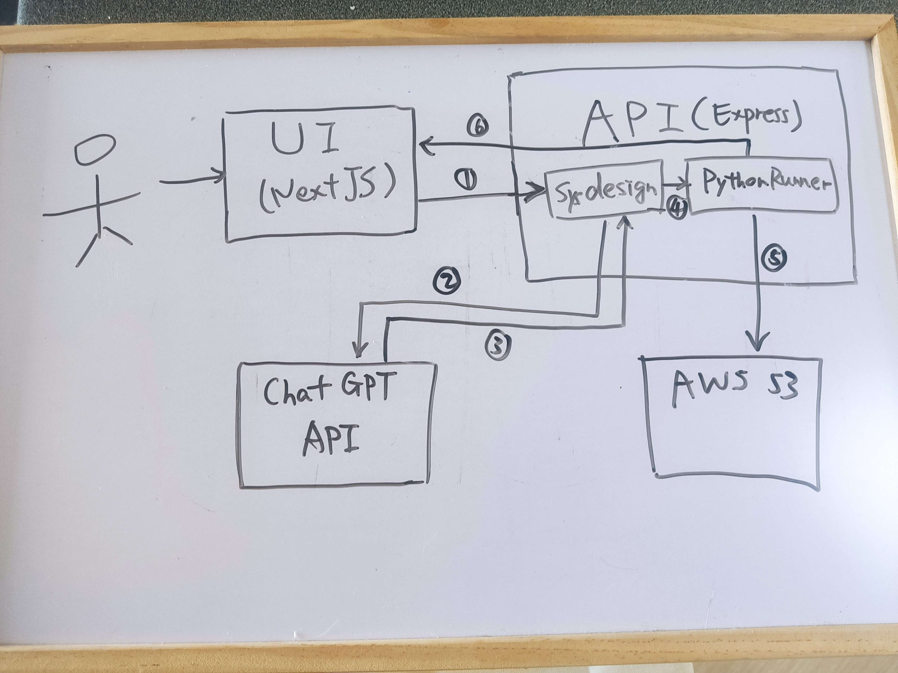

# AI Generated System Design

Hi! This is one of my personal projects to build a system design tool enpowered by AI.

Just describe your system's functional and non-functional requirements, you can obtain a ~~high quality~~ AI generated system architecture diagram right away. Try it out [here](https://www.ai-sysdesign.com/)!

## How it works

The tool mainly consists of a web UI (built with NextJS) and a backend API (built with ExpressJS). The API talks with ChatGPT which generates the system designs. Besides, AWS S3 is used to host the system diagrams. Below is the overview of the system:

Workflow:

1. Users describe system requirements in UI. Then the requirements are sent to the `Sysdesign` component in the API service.
2. `Sysdesign` puts together a message and sent it to ChatGPT API, querying for a system diagram (represented as python code!).
3. ChatGPT returns some (nice or broken) python code.
4. The code is sent to the `PythonRunner` component for execution.
5. After executing the code, `PythonRunner` uploads the resulting diagram to AWS S3.
6. The URL of the diagram is returned to the UI for users to view the diagram.

## Hurdles during the project

> It's hard to get ChatGPT to generate code that compiles! Errors include importing non-existing modules, invoking non-existing class functions, missing quotes and other syntax errors.

My approach is to add some restrictions on what can be imported. Also write the critical code explicitly and let ChatGPT fill the rest. This enhanced the success rate of the code generation, but haven't reached 100%. Maybe wait until ChatGPT 20?

> It's hard to get ChatGPT to return code only! It likes to explain things and start the answer with "Certainly! ....", which has an adverse effect on the overall response time of API.

After many trials, the final instructions I sent to ChatGPT become quite verbose, but still can't get a clean code answer 100% of the time.

> Error handling is more complex due to the unstable responses from ChatGPT.

Needs to take into account different failure reasons, each needs to be addressed differently:

- ChatGPT returns bad code.
- ChatGPT refuses to provide code with good reason.
- Other errors like network errors, quota limit, etc.

## Optimisations

If you have a better way to do things or want to add some new features, contributions to this repo are very welcomed!
